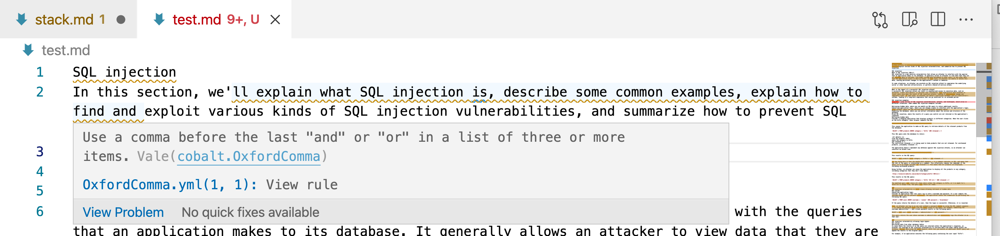

# English Grammar Linter (Vale)

This repository includes `beta` rules based on the [Vale grammar linter](https://docs.errata.ai/#vale). To install Vale on a Mac, run:

```
brew install vale
```

You can set up Vale with several different IDEs. For this repository,
we've tested the integration between Vale and VSCode, and described some tips and tricks
in [Use Vale in Your IDE](#use-vale-in-your-ide).

Vale pulls rules from YAML files in the `styles/` subdirectory. They include grammar rules in the following subdirectories:

- Modified rules from GitLab in the `styles/cobalt/` subdirectory
- [Google Developer Style Guide](https://github.com/errata-ai/Google) rules, customized for Vale, in the `styles/Google` subdirectory
- Rules associated with the [write-good](https://github.com/btford/write-good) grammar linter

These rules are a "Work in Progress"; we may overrule/modify them as we use them to review Cobalt content. For example, if you find a common word / acronym that we use, you're
welcome to add it (with a PR) to our `styles/cobalt/spelling-exceptions.txt` file.

For more information, see the [Vale documentation](https://docs.errata.ai/).

## Vale Configuration

The Vale configuration file is .vale.ini. In this file, we see: 

- The `StylesPath` points to rules in the `styles/` subdirectory.
- The `BasedOnStyles` parameter specifies style subdirectories.
- The `IgnoredScopes` tells Vale to ignore content such as code samples, as described in [Vale Documentation](https://docs.errata.ai/vale/config#ignoredscopes).

## Use Vale in Your Repository

If you want to use this Vale configuration in your repository, copy:

- `.vale.ini`
- The `styles/` subdirectory

If you copy Vale configuration files to your repository, and want to "change the rules,"
open a PR against this cobalt-product-public-docs repository.

## Use Vale in Your IDE

You can set up Vale with several different IDEs. For more information, see the
[Integrations](https://docs.errata.ai) section of the Vale documentation.

For example, you can set up a Vale plugin with the VSCode IDE, per
https://github.com/errata-ai/vale-vscode#using-vale .

**_Note:_** if you're working with Markdown or text files, you do not need "Vale Server."

If you have problems with Vale in VSCode, you may need to:

- Restart VSCode
- Disable / re-enable the Vale plugin
- Save changes to the Markdown file that you're analyzing

If you're successful, you'll see linting messages similar to what's shown in the following screenshot:

<p align="center">
    
</p>

While we've set up Vale as a plugin for other IDEs (including vim), we haven't documented
the process here. In most cases, you can read about how to integrate Vale into other
IDEs in the [Integrations](https://docs.errata.ai) section of the Vale documentation.

If you want to use Vale for your own repository, make sure to copy Vale configuration
files as described in the following section:
[Use Vale in Your Repository](#use-vale-in-your-repository).

## Use Vale at the Command Line

To review your content against the given style guide rules, first navigate to the root
directory for this repository. Then run the following command:

```
vale /path/to/your/filename.md
```

As long as you're in the root directory for this repository, you can use Vale at the command line to lint Markdown files in any local directory.
